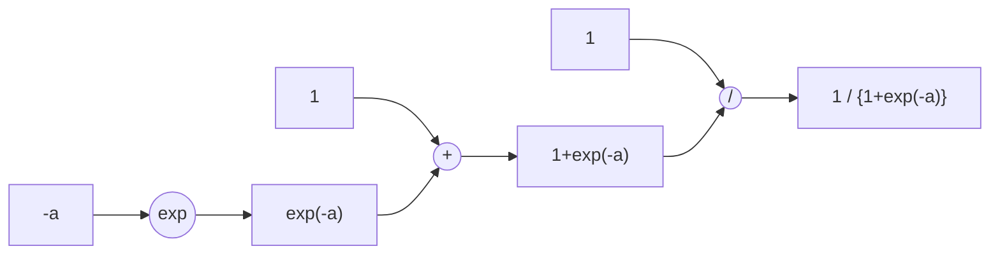

# Reinventing-TorchGrad

PyTorch の 自動微分アルゴリズムの再現実装



```python
import math
from autograd import Tensor, exp

a = Tensor(3)
s = 1 / (1 + exp(-a))
s.backward()

assert math.isclose(s.value, 1 / (1 + math.exp(-3)))  # OK
assert math.isclose(a.grad, s.value * (1 - s.value))  # OK
```

## 環境構築

MacOS, Linux

```
python -m venv venv
source venv/bin/activate
pip install -e .
```

Windows

```
python -m venv venv
venv\Scripts\activate
pip install -e .
```
